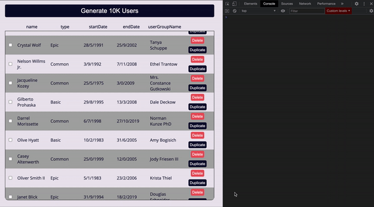

This is a demo of an isomorphic JS app which includes a REST API server (wriiten in Node.js and using Express), which serves Promotion documents stored in MongoDB, and presented in a Table built with React, all written with TypeScript.

In this project you'll find that under the `src/` directory there are two TS projects: `server` and `client`.  
Both the server and the client share code which resides in the `types/` and `utils/` directories.

## Usage
- First make sure to run `nvm use` to set the proper Node.js version (12.18).
- Run `npm install`.
- Run `npm run dev`. This sets up the dev server and the mongodb Docker container.

The server is listening on `localhost:8081`.  
The mongodb instance is listening on `localhost:27018`.
